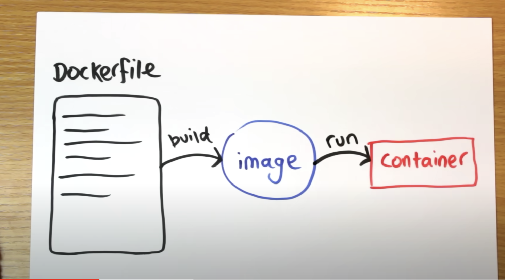

# 42KL-22-Inception

### Docker
    -   Port 443
        Standard port for HTTPS
    -   Port 80
        HTTP
---
### Docker 

    1.  Dockerfile
        -   source code of the image

    2.  Docker Images
        -   Blueprint
  
    3.  Docker Containers
   
    4.  Docker Registry
        -   Save Docker Images
        -   Most common one - Docker Hub
   
    5.  Docker Volume
        -   Save data
        -   Used to persist data generated by Docker containers, they exist independently of the containers

    6.  Docker network
        -   Allow Docker containers to communicate with each other and with the outside world
        -   Docker networking provides a range of networking options
            - Default Bridge Network: When you install Docker, it creates a default bridge network. By default, containers are attached to this network, allowing them to communicate using IP addresses within the same network
____

### Docker commands
    1. docker ps
        -   List all running containers

    2.  docker images
        -   List Docker images that are available locally
        -   Docker images are used as templates to create Docker containers
  
    3. docker ps -qa
        -   -q stands for "quiet" mode, which outputs only container IDs, rather than their full details
        -   -a "all"- show all containers, both running and stopped ones
        -   By default, docker ps only shows running containers, but with -a, it includes all containers
  
    4. docker stop $(docker ps -qa)
        -   Stops all running Docker containers by first listing all container IDs using docker ps -qa,
        -   Then passing these IDs to the docker stop command
    
    5. docker rm $(docker ps -qa)
        -   Remove a container
    
    6.  docker rmi -f $(docker images -qa)
        -   Remove Docker images
        -   -f force forcibly remove
        -   if no -f, Docker will not delete an image if it is being used by one or more containers, and it will display an error message indicating that the image is in use
  
    7.  $(docker network ls -q) 2>/dev/null
        -   2>/dev/null
            -   Redirects standard error (stderr) to /dev/null
            -   /dev/null is a special device file that discards data written to it

___

### Docker v docker-compose
    - Docker
      - Containerization Engine
        - A containerization platform that provides tools for building, running and managing containers. 
        - Includes the Docker Engine, which is responsible for building, running, and managing containers
      - Single Container Management

    - Docker compose
      - Application orchestration
        - A tool for defining and running multi-container Docker applications
        - Allows you to define the services, networks, volumes, and other configurations for a multi-container application in a single YAML file (docker-compose.yml)
___

### Useful commands

    -   Add user to docker group
        sudo usermod -aG docker $USER

___

### Nginx

    -   Nginx Dockerfile
        Use to build a Docker image for an nginx web server with SSL support

    -   Nginx -g daemon off
        Nginx
        Start Nginx web server

        -G
        Set global configuration directives at runtime
        
        Daemon off
        Tell Nginx to run in the foreground (not as a daemon). Useful for debugging purposes or when you want to run Nginx without detaching it from the current terminal session. By default, Nginx runs as a daemon in the background, meaning it starts as a separate process and continues to run even after you close the terminal session.     
___

### Docker v Virtual Machines

    Virtual Machines
    -   Has it's own full operating system & typically slower

    Containers
    -   Share the host's operating system & typically quicker

    Virtual Machine
    -   VMware
    -   Virtualbox
    -   Paralels Desktop
    -   WSL
    -   Hyper-V

___

### Cool commands

    -   apt-get install -y htop
    -   htop
        system monitor
    -   su 
        go to root
    -   ps -ef | grep nginx 
        check nginx status
    -   sudo lsof -i:443
        list all open files/network sockets associated with the specified port
  
____

### WordPress

    -   Running WordPress involves installing a LAMP or LEMP
    -   LAMP - Linux, Apache, MySQL, PHP
    -   LEMP - Linux, Nginx,  MySQL, PHP 
    -   Using Docker & Docker Compose, you can streamline the process

___

### Entrypoint v CMD

    -   Entrypoint
        -   Set the primary command
    -   CMD
        -   Define the command to be run if Entrypoint is not specified
    -   If a Dockerfile includes both Entrypoint and CMD, 
        the CMD values are passed as arguments to the Entrypoint
